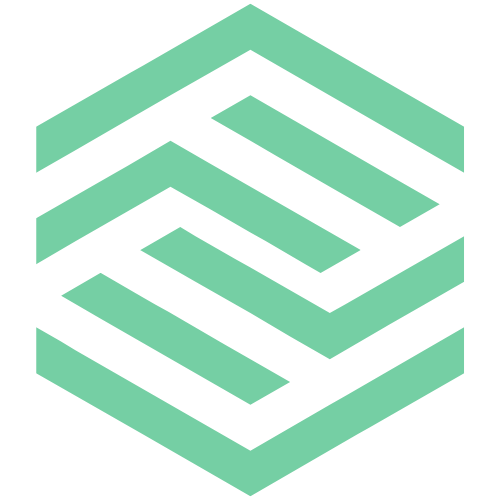
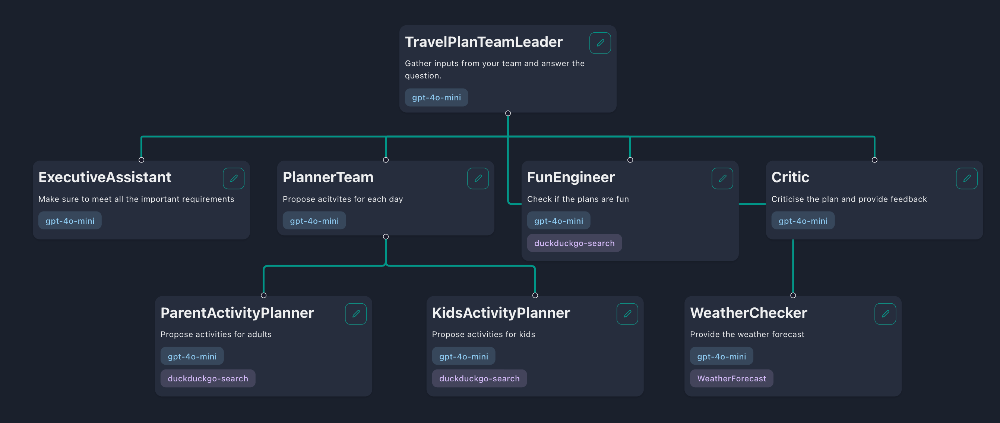

<div align="center">
  
  <h1>Flowgentic AI</h1>
  <p>✨ <b>Low code tool to rapidly build and coordinate multi-agent teams</b> ✨</p>
</div>

<figure>
    
    <figcaption>Build a multi-agent team like this with simple drag and drop in minutes! 🤩</figcaption>
</figure>

> [!WARNING]
> This project is NOT affiliated with any blockchain-related projects in any way. Be cautious of scammers falsely claiming association. Stay vigilant!

> [!WARNING]
> This project is currently under heavy development. Please be aware that significant changes may occur.

## What is Flowgentic?
Have you heard the saying, 'Two minds are better than one'? That's true for agents too. Flowgentic leverages on the langgraph framework to let you customize and coordinate teams of agents easily. By splitting up tough tasks among agents that are good at different things, each one can focus on what it does best. This makes solving problems faster and better.


## What are some use cases?
By teaming up, agents can take on more complex tasks. Here are a few examples of what they can do together:
- **⚽️ Footbal analysis**: Imagine a team of agents where one scours the web for the latest Premier League news, and another analyzes the data to write insightful reports on each team's performance in the new season.
- **🏝️ Trip Planning**:  For planning your next vacation, one agent could recommend the best local eateries, while another finds the top-rated hotels for you. This team makes sure every part of your trip is covered.
- **👩‍💻 Customer Service**:  A customer service team where one agent handles IT issues, another manages complaints, and a third takes care of product inquiries. Each agent specializes in a different area, making the service faster and more efficient.

and many many more!

## Highlights
- **Persistent conversations**: Save and maintain chat histories, allowing you to continue conversations.
- **Observability**: Monitor and track your agents' performance and outputs in real-time using LangSmith to ensure they operate efficiently.
- **Tool Calling**: Enable your agents to utilize external tools and APIs.
-  **Retrieval Augmented Generation**: Enable your agents to reason with your internal knowledge base.
- **Human-In-The-Loop**: Enable human approval before tool calling.
- **Open Source Models**: Use open-source LLM models such as llama, Gemma and Phi.
- **IntegrateFlowgentic  with external application**: Use Flowgentic's public API endpoints to interact with your teams.
- **Easy Deployment**: Deploy Flowgentic effortlessly using Docker.
- **Multi-Tenancy**: Manage and support multiple users and teams.

## How to get started

Before deploying it, make sure you change at least the values for:

- `SECRET_KEY`
- `FIRST_SUPERUSER_PASSWORD`
- `POSTGRES_PASSWORD`

You can (and should) pass these as environment variables from secrets.

### Generate Secret Keys

Some environment variables in the `.env` file have a default value of `changethis`.

You have to change them with a secret key, to generate secret keys you can run the following command:

```bash
python -c "import secrets; print(secrets.token_urlsafe(32))"
```

Copy the content and use that as password / secret key. And run that again to generate another secure key.


## Guides and concepts

### Sequential vs Hierarchical workflows

#### Sequential workflows

In a sequential workflow, your agents are arranged in an orderly sequence and execute tasks one after another. Each task can be dependent on the previous task. This is useful if you want to tasks to be completed one after another in a deterministic sequence.

Use this if:
- Your project has clear, step-by-step tasks.
- The outcome of one task influences the next.
- You prefer a straightforward and predictable execution order.
- You need to ensure tasks are performed in a specific order.

#### Hierarchical workflows

In a hierarchical workflow, your agents are organised into a team-like structure comprising of 'team leader', 'team members' and even other 'sub-team leaders'. The team leader breaks down the task into smaller tasks and delegate them to its team members. After the team members complete these tasks, their responses will be passed to the team leader who then chooses to return the response to the user or delegate more tasks.

Use this if:
- Your tasks are complex and multifaceted.
- You need specialized agents to handle different subtasks.
- Task delegation and re-evaluation are crucial for your workflow.
- You want flexibility in task management and adaptability to changes.

### Skills

Skills are abilities that you can equip your agents with to interact with the world. For example, you can provide your agent with the skill to check the current weather condition or search the web for the latest news. By default, Flowgentic provides three skills:

- **duckduckgo-search**: Performs web searches.
- **wikipedia**: Searches Wikipedia for information.
- **yahoo-finance**: Retrieves information from Yahoo Finance News.

You will likely want to create custom skills, which can be done in two ways: by using function definitions for simple HTTP requests or by writing custom skills in the codebase.

#### Create a Skill Using Skill Definitions

If your skill involves performing an HTTP request to fetch or update data, using skill definitions is the simplest approach. In Flowgentic, start by navigating to the 'Skills' tab and clicking the 'Add Skill' button. You will then be prompted to provide the skill definition, which instructs your agent on how to execute the specific skill. This definition should be structured as follows:

```json
{
  "url": "https://example.com",
  "method": "GET",
  "headers": {},
  "type": "function",
  "function": {
    "name": "Your skill name",
    "description": "Your skill description",
    "parameters": {
      "type": "object",
      "properties": {
        "param1": {
          "type": "integer",
          "description": "Description of the first parameter"
        },
        "param2": {
          "type": "string",
          "enum": ["option1"],
          "description": "Description of the second parameter"
        }
      },
      "required": ["param1", "param2"]
    }
  }
}
```

| Key                      | Description                                                                                                                                                                |
| ------------------------ | -------------------------------------------------------------------------------------------------------------------------------------------------------------------------- |
| `url`                    | The endpoint URL for the API call.                                                                                                                                         |
| `method`                 | The HTTP method used for the request. It can be `GET`, `POST`, `PUT`, `PATCH`, or `DELETE`.                                                                                |
| `headers`                | Any HTTP headers to include in the request.                                                                                                                                |
| `function`               | Contains details about the skill:                                                                                                                                          |
| `function > name`        | The name of the skill. Follow these rules: only letters (a-z, A-Z), numbers (0-9), underscores (_), and hyphens (-) are allowed; must be between 1 and 64 characters long. |
| `function > description` | Describes the skill to inform the agent about its usage.                                                                                                                   |
| `function > parameters`  | Details about the parameters the API accepts.                                                                                                                              |
| `properties > param`     | The name of the query or body parameter. For `GET` methods, this will be a query parameter. For `POST`, `PUT`, `PATCH`, and `DELETE`, it will be in the request body.      |
| `param > type`           | Specifies the type of the parameter, which can be `string`, `number`, `integer`, or `boolean`.                                                                             |
| `param > description`    | Provides context about the parameter's purpose.                                                                                                                            |
| `param > enum`           | Optionally, include an array to restrict the agent to select from predefined values.                                                                                       |
| `parameters > required`  | Lists the parameters that are required, ensuring they are always included in the API request.                                                                              |


### Retrieval Augmented Generation (RAG)

RAG is a technique for augmenting your agents' knowledge with additional data. Agents can reason about a wide range of topics, but their knowledge is limited to public data up to the point in time they were trained on. If you want your agents to reason about private data, Flowgentic allows you to upload your data and select which data to include in your agent's knowledge base. This enables your agents to reason with the selected data and allows you to create different agents with specialized knowledge.

#### Customising embedding models

By default, Flowgentic uses `BAAI/bge-small-en-v1.5`, which is a light and fast English embedding model that is better than `OpenAI Ada-002`. If your documents are multilingual or require image embedding, you may want to use another embedding model. You can easily do this by changing `DENSE_EMBEDDING_MODEL` in your `.env` file:

```bash
# See the list of supported models: https://qdrant.github.io/fastembed/examples/Supported_Models/
DENSE_EMBEDDING_MODEL=BAAI/bge-small-en-v1.5 # Change this
```

> [!WARNING]
> If your existing and new embedding models have different vector dimensions, you may need to recreate your Qdrant collection. You can delete the collection through the Qdrant Dashboard at [http://qdrant.localhost/dashboard](http://qdrant.localhost/dashboard). Therefore, it is better to plan ahead which embedding model is most suitable for your workflows.

### Using Open Source Models

Open source models are becoming cheaper and easier to run, and some even match the performance of closed models. You might prefer using them for their privacy and cost benefits. If you are running Flowgentic locally and want to use open source models, I would recommend Ollama for its ease of use.

#### Using Open Source Models with Ollama
1. **Install Ollama:** First, set up Ollama on your device. You can find the instructions in [Ollama's repo](https://github.com/ollama/ollama).
2. **Download Models:** Download your preferred models from Ollama
3. **Configure your agents:**
   - Update the agent's provider to `ollama`.
   - Paste the downloaded model's name (e.g., `llama3.1:8b`) into the model input field.
   - By default, Flowgentic will run on `http://host.docker.internal:11434`, which maps to `https://localhost:11434`. This setup allows Flowgentic to communicate with the default Ollama host. If your setup uses a different host, specify the new host in the 'Base URL' input field.

#### Choosing the Right Models
There are hundreds of open source models in [Ollama's library](https://ollama.com/library) suitable for different tasks. Here's how to choose the right one for your use case:
- **Tool Calling Models:** If you are planning to equip agents with specific skills, use models like `Llama3.1`, `Mistral Nemo`, `Firefunction V2`, or `Command-R +` and others that support tool calling.
- **For Creative, Reasoning and other Tasks:** You have more flexibility. You may stick to tool calling capable models or consider models like `gemma2` or `phi3`.

#### Using Open Source Models without Ollama

If you're not planning to use Ollama, you can still run open source models compatible with the [OpenAI chat completions API](https://platform.openai.com/docs/api-reference/introduction).

Steps:
1. **Edit Your Agent:** Select 'OpenAI' as your model provider.
2. **Specify Endpoint:** Under 'Base URL', specify the model's inference endpoint.
